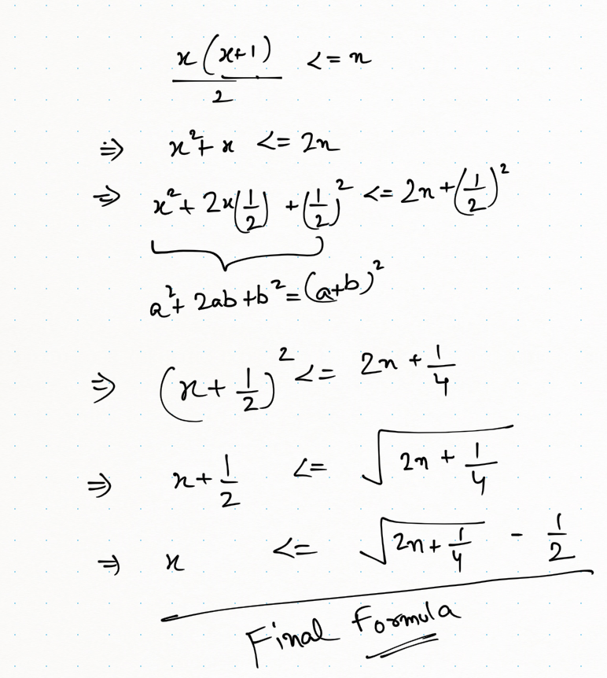

# PROBLEM STATEMENT
You are given a positive integer array grades which represents the grades of students in a university. You would like to enter all these students into a competition in ordered non-empty groups, such that the ordering meets the following conditions:

    1. The sum of the grades of students in the ith group is less than the sum of the grades of students in the (i + 1)th group, for all groups (except the last).
    2. The total number of students in the ith group is less than the total number of students in the (i + 1)th group, for all groups (except the last).
   
Return the maximum number of groups that can be formed.

# EXAMPLE

    Input: grades = [10,6,12,7,3,5]
    Output: 3
    Explanation: The following is a possible way to form 3 groups of students:
    - 1st group has the students with grades = [12]. Sum of grades: 12. Student count: 1
    - 2nd group has the students with grades = [6,7]. Sum of grades: 6 + 7 = 13. Student count: 2
    - 3rd group has the students with grades = [10,3,5]. Sum of grades: 10 + 3 + 5 = 18. Student count: 3

It can be shown that it is not possible to form more than 3 groups.

# **HOW TO FIND IF A CERTAIN NUMBER OF GROUPS ARE VALID FOR GIVEN INPUT**

One thing to note is this problem statement does not ask us to return the groups with grades in them. It asks us to return the count of groups. So the main thing here is to think how can we know if a particular number can be a valid group count for a given number of grades.

And this also means, the first condition is of no use here. Because for the first condition, we can just sort the given grades array and then fill up all the groups. But again, as I said, there is no need for that. We are only asked the count of groups. 

Now, just think what can be the least value for number of groups? It can be 1 right? Because there can be at least 1 group which is the whole array itself.

What about the highest value? That's what we are asked to find. But we know the highest value will never exceed the length of grades array. In fact, it will always be lower than length of grades array. So we can assume the upper bound as n. 

Hence, that means, we will find the maximum number of groups in the range 1 to n only.

As per the second condition - 

	The total number of students in the ith group is less than the
	total number of students in the (i + 1)th group, for all groups (except the last).
	
So we can assume that grades is sorted already and then we think how should we fill the groups?

		e.g. grades = [10,6,12,7,3,5]
		sorted => [3,5,6,7,10,12]
		
		So, how to start filling? We want each new group to have more grades than previous group
		
		Since it is sorted already, our first condition will always be true 
		i.e., sum of grades in ith group is less than sum of grades in (i + 1)th group
		
		The simplest way is to fill the first group with 1 grade. Which is the smallest grade of all.
		
		Group 1 = [3]
		
		Then, since we want next group to have more than 1 grades, we fill it with 2 grades.
		
		Group 2 = [5,6]
		
		Then, the next group has 3 grades.
		
		Group 3 = [7,10,12]
		
		And now we see all our grades are in their respective groups. So, total groups = 3
		
		
Did you notice that this pattern of filling the groups is like -> 1, 2, 3 , 4

That is, group1 has 1 grade, group2 has 2 grades, group 3 has 3 grades and so on....

	So, if we are given any value denoting number of groups. e.g.., 4. 

	Can we find how many grades are there in total in 4 groups? Yes we can!
	
	Since we are filling in this pattern -> 1,2,3,4
	
	This means, if we have 4 groups, there are 1 + 2 + 3 + 4 => 10 grades.
	
Since for any number of groups, we can find number of grades in total, that means, all we need to ensure is that the number of total grades does not exceed number of grades in our input array. Which is quite obvious because we can only make groups out of given number of grades. 

And hence, the formula to check if a number if a valid number of groups is ->

			x * (x + 1) / 2 <= n

Because 1 + 2 + 3 + 4 is something we can do using the formula to calculate sum of 'n' natural numbers. i.e., n(n+1)/2

So now, we have the lower bound, upper bound, and the formula to check if valid. Now this problem becomes pretty straightforward.

# **1. BRUTE FORCE APPROACH - O(N)**
The simplest approach is to go from each value from 1 to n and if a value is valid, set count to that value. And since we want to maximize the solution, keep searching for a bigger valid value.

# **2. BINARY SEARCH APPROACH - O(LogN)**
Why do a linear search when the range 1 to n is in sorted order ? 

# **3. MATH APPROACH - O(1)**

